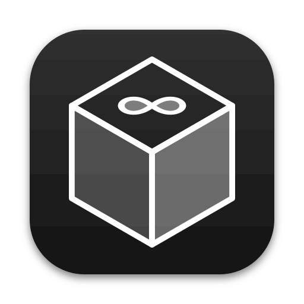
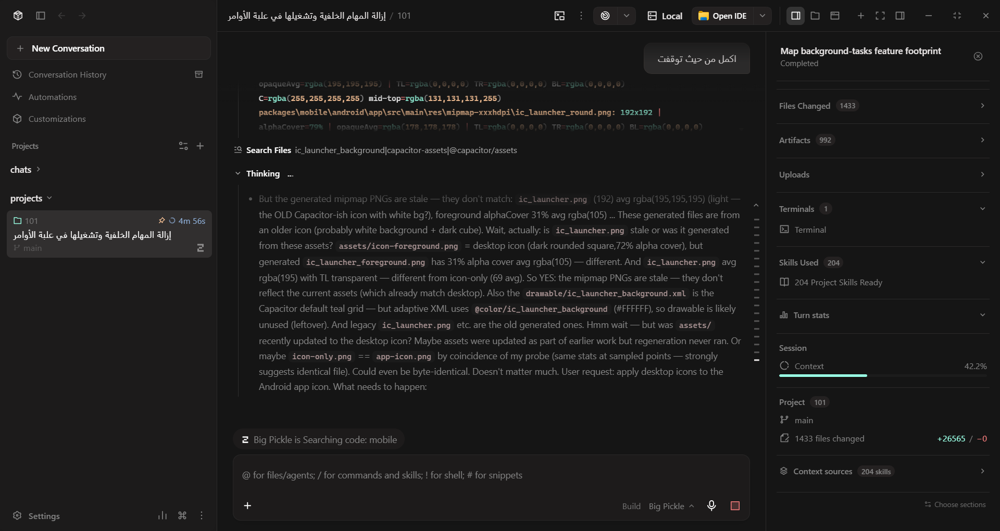
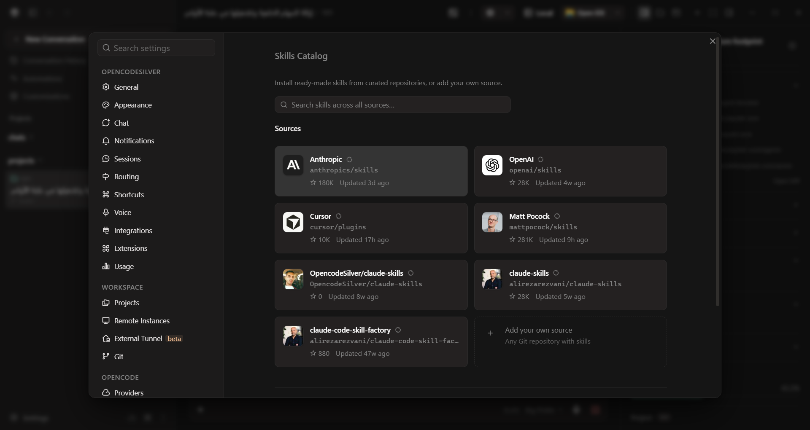
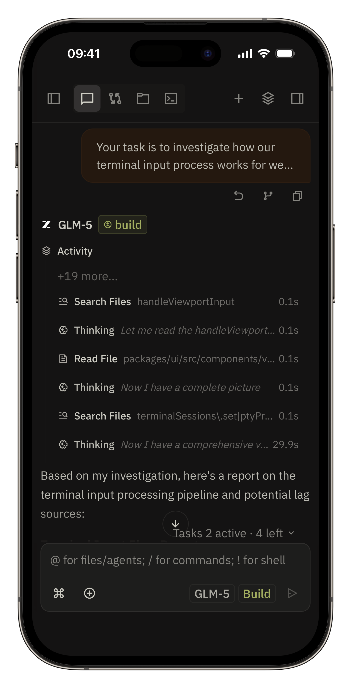
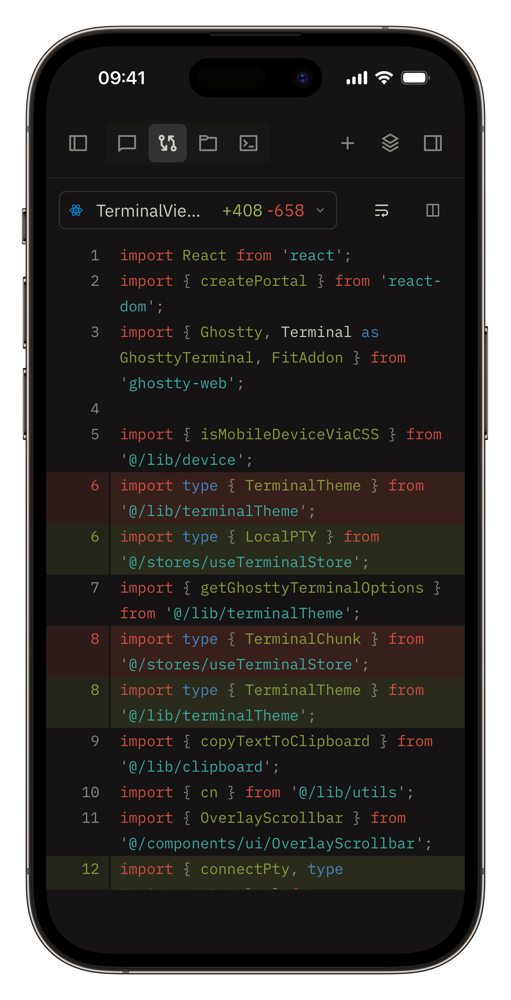

<p align="center">
  <a href="https://github.com/OpencodeSilver/OpencodeSilver">
    
  </a>
</p>

<h1 align="center">OpencodeSilver</h1>

<p align="center">
  <strong>The complete, autonomous AI coding environment for Desktop, Web/PWA, and Visual Studio Code.</strong><br />
  <em>Open-source workspace designed to run, orchestrate, and supervise AI coding agents across all platforms with full transparency and control.</em>
</p>

<p align="center">
  <a href="https://github.com/OpencodeSilver/OpencodeSilver/releases"></a>
  <a href="https://github.com/OpencodeSilver/OpencodeSilver/releases/latest"></a>
  <a href="https://github.com/OpencodeSilver/OpencodeSilver/releases/latest"></a>
  <a href="https://github.com/OpencodeSilver/OpencodeSilver/discussions"></a>
</p>

---

## 🖥️ Desktop & Skills Marketplace Preview

<p align="center">
  
</p>
<p align="center">
  <em>OpencodeSilver Desktop — Unified workspace featuring autonomous agents, interactive prompt composer, productivity toolbar, and integrated right-hand context rail.</em>
</p>

<p align="center">
  
</p>
<p align="center">
  <em>Skills Marketplace & Catalog — Modernized card grid with dynamic GitHub author avatars, real-time repository search, verified packages, and quick installation.</em>
</p>

---

## 📖 What is OpencodeSilver?

**OpencodeSilver** is an open-source, full-stack AI development workspace built on top of the OpenCode engine. It provides engineers with full visibility and granular control over autonomous agent workflows. Inspect changes line-by-line, run parallel model experiments, and track session goals across Desktop (Windows, macOS, Linux), Web / PWA, and directly inside **Visual Studio Code**.

---

## 🚀 What's New in OpencodeSilver

* **📚 180 Default Skills Bundled (`assets/1.png`):** Fresh installs now ship with 180 default skills instead of an empty workspace. The 68-skill catalog is joined by 112 more covering prompt engineering, browser automation, databases (Prisma, Neon, Supabase), deployment (Vercel, Netlify, Cloudflare), PDF and Office documents, and design workflows. The marketplace still installs anything else on top.
* **🌌 Google Antigravity v2 Replica:** The full Antigravity interface rebuilt 1:1 inside OpencodeSilver: agent activity tray, live trajectory drawer, and master prompt composer, localized across all 14 languages.
* **🧹 Background Tasks Removed:** The background-tasks feature is gone, along with its task panel, trajectory, and completion chime. Long-running work now runs through Session Goals and scheduled tasks, where its state and token budget stay visible in the session.

---

## ✨ Key Features

### 1. 🏗️ AI Prompt Optimizer & End-to-End Blueprinting
* Generate production-ready software architectures and comprehensive execution plans from a single thought.
* Full support for native Arabic and English phrasing with intelligent cross-lingual translation.

### 2. 🎯 Continuous Session Goals
* Define end-to-end mission goals for your session. OpencodeSilver evaluates output after each step and keeps guiding the agent until completion.

### 3. ⚡ Multi-Run & Model Fusion
* Dispatch the exact same prompt or task to up to 5 different AI models in parallel using isolated Git worktrees.
* Compare implementation approaches, benchmark accuracy, and use **Fusion** to synthesize the best parts into a single refined solution.

### 4. 🔍 Interactive Changes Walkthrough
* Converts massive code diffs into structured, step-by-step interactive walkthroughs.
* Groups related modifications together with contextual explanations of architecture decisions and downstream effects.

### 5. 🌐 Native Auto-Updater
* Built-in update engine powered directly by GitHub Releases.
* Smooth toast notifications inform you of updates and let you download and apply them seamlessly with a single click.

### 6. 📱 Seamless Cross-Platform Sync
* Access the same workspaces and active sessions across desktop, web browser, VS Code, and mobile devices.
* Secure end-to-end encrypted communication via **Private Relay** with quick QR pairing—no firewall holes or external server setup required.

### 7. 📤 Smart Session Exporter & Metrics Card
* Export entire session transcripts and agent reasoning turns to clean Markdown with a single click.
* Inspect comprehensive session analytics including total messages, executed tools, files touched, and token consumption.

### 8. 🛡️ Secret Leak Protection & Command Safety Badges
* Real-time pattern scanner warns against accidental pasting of OpenAI, Anthropic, AWS, or GitHub secret keys.
* Automatic command safety grading alerts on dangerous, recursive, or forced terminal commands.

### 9. 📋 Enhanced Codeblocks with One-Click Copy & Line Counts
* Dedicated toolbar on code blocks displaying programming language, line count, and instant clipboard copy with toast feedback.

### 10. 🌌 Google Antigravity Interface Replica
* Live trajectory drawer showing agent steps, touched files, and active skills as they happen.
* Agent activity tray and master prompt composer matching the Antigravity v2 experience, localized across all 14 languages.


---

## 🧩 Supported Platforms

| Platform | Description & Role |
| :--- | :--- |
| 💻 **Desktop (Windows / macOS / Linux)** | Native Electron application with multi-window support, mini chat overlay, native notifications, and local OpenCode CLI integration. |
| 🔌 **VS Code Extension** | Run agent sessions directly alongside your editor tabs, inject context selections, and apply diffs in-place. |
| 🌐 **Web / PWA** | Access your workspace remotely from any modern browser with installable offline PWA capabilities. |
| 📱 **Mobile (iOS / Android)** | Monitor background jobs on the go, receive completion push notifications, and interact with the terminal. |

---

## 📦 Quick Downloads

| File | Platform | Description |
| :--- | :--- | :--- |
| [**OpencodeSilver-win-x64.exe**](https://github.com/OpencodeSilver/OpencodeSilver/releases/latest) | Windows (x64) | Full standalone installer bundled with the latest OpenCode CLI engine |
| [**opencodesilver.vsix**](https://github.com/OpencodeSilver/OpencodeSilver/releases/latest) | VS Code Extension | Official extension package for Visual Studio Code |
| [**All Release Notes (`docs/releases`)**](docs/releases/README.md) | Documentation | Full Markdown release notes |
| [**All Release Assets & Changelog**](https://github.com/OpencodeSilver/OpencodeSilver/releases) | All Platforms | Full release notes, blockmaps, and assets on GitHub |


---

## 🚀 Installing the VS Code Extension (.vsix)

1. Download the extension file: [`opencodesilver.vsix`](https://github.com/OpencodeSilver/OpencodeSilver/releases/latest).
2. Open **VS Code**.
3. Open the Extensions sidebar (`Ctrl + Shift + X` or `Cmd + Shift + X`).
4. Click the three dots menu icon (`...`) at the top right of the Extensions panel.
5. Select **Install from VSIX...** and choose the downloaded file.

---

## 📱 Mobile Previews

<p align="center">
  
  &nbsp;&nbsp;
  
</p>

---

## 🛠️ Build from Source

```bash
# 1. Clone the repository
git clone https://github.com/OpencodeSilver/OpencodeSilver.git
cd OpencodeSilver

# 2. Install dependencies
bun install

# 3. Start local development mode
bun run dev

# 4. Build desktop app (Windows Installer)
bun run build:web
bun run electron:build

# 5. Package the VS Code extension (.vsix)
bun run --cwd packages/vscode package
```

---

## 🤝 Contributing & Community

* 🐛 **Found a bug or issue?** [Open an issue on GitHub](https://github.com/OpencodeSilver/OpencodeSilver/issues/new)
* 💡 **Have a feature idea or feedback?** [Join the discussion on GitHub Discussions](https://github.com/OpencodeSilver/OpencodeSilver/discussions)

---

<p align="center">
  Licensed under the <strong>MIT License</strong> • Maintained and engineered by <strong>OpencodeSilver</strong>
</p>
